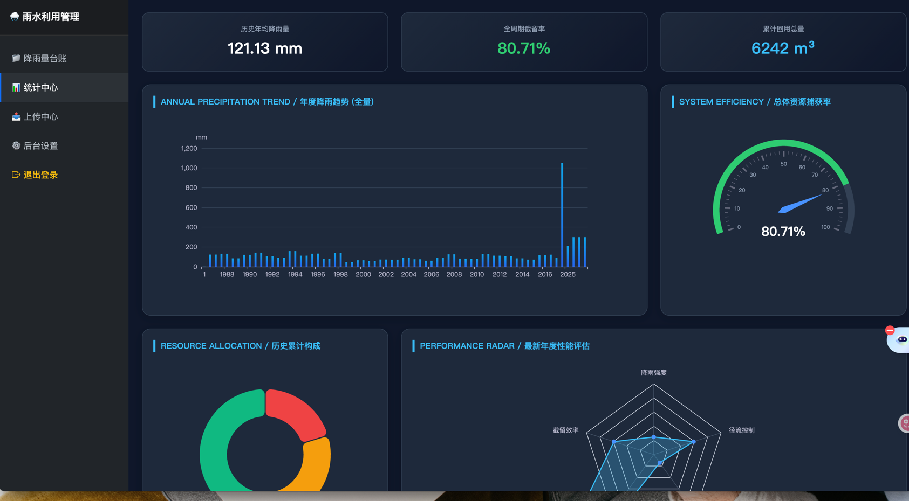

# Group 04 submit final projects
The about a Rainwater Utilization Rate System

---

# 🌧️ 雨水利用管理系统 (Rainwater Harvest OS)

---

## 访问相关
访问地址：https://foundrous-dominick-interhemal.ngrok-free.dev
账号密码：admin/admin123

## 数据库 MySQL
必须本地或者云端启动 MySQL 数据库服务，才能正常跑通项目。

## 📸 界面预览

### 系统登录页面


采用了深色系（Slate/Navy）专业底色，专为中控室大屏或监控终端设计。

* **年度趋势**：全量展示历史降雨波峰波谷。
* **资源捕获率**：实时显示当前系统的总体截留效率仪表盘。
* **回用构成**：清晰呈现溢流、洗车与灌溉的资源分配比例。

### 2. 降雨量台账 (Data Ledger)

简洁明快的高性能数据表格，支持百万级数据分页加载。

* **截留率标签**：根据降雨量与溢流量自动计算，通过蓝色圆角标签直观显示。
* **快速录入**：顶部集成表单，支持 0.1mm 精度的即时数据提交。


### 3. 统计中心 (Data Ledger)
数据可视化，每年总降水量统计



### 4. 上传中心 (Upload Center)

拖拽式的 Excel 同步界面。

* **自动校准**：后台逻辑会在文件解析时自动将数值四舍五入至 1 位小数。
* **动态模板**：一键生成符合格式要求的 `.xlsx` 模板文件。


---

## ✨ 核心功能亮点

* **📈 全量数据可视化**：基于 ECharts 5，不因分页而限制统计视野。
* **📤 智能 Excel 处理**：后台强制 **1位小数点** 精度控制，确保数据入库口径严谨。
* **🔐 权限认证**：护眼模式登录界面，基于 Session 的安全认证机制。

---

## 🚀 快速启动

1. **环境准备**：
```bash
pip install flask flask-sqlalchemy pymysql openpyxl

```


2. **数据库创建**：
在 MySQL 中执行 `CREATE DATABASE rain_system CHARACTER SET utf8mb4;`
3. **运行程序**：
修改 `app.py` 中的 `DB_PASS` 后执行 `python app.py`。

---

## 📖 导入标准规范 (Excel)

系统严格匹配以下字段顺序，导入前请确保表头一致：

| 年份 | 降雨量(mm) | 溢流量(mm) | 洗车(m³) | 灌溉(m³) |
| --- | --- | --- | --- | --- |
| 2026 | 1050.5 | 210.2 | 50.0 | 120.0 |

---

© 2026 雨水利用管理系统项目组 | **为可持续环境助力** 🌱
